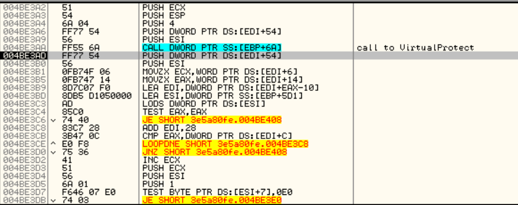
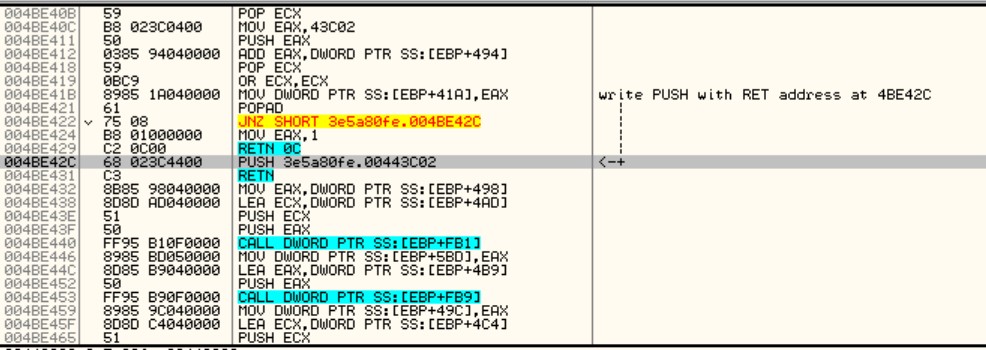
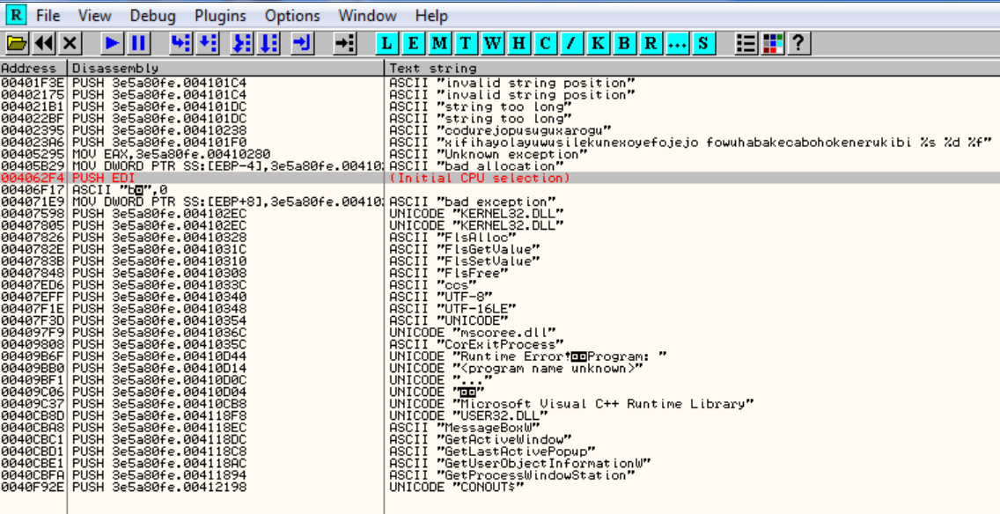
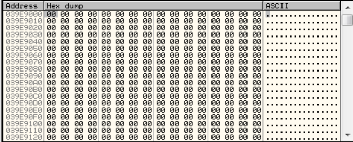
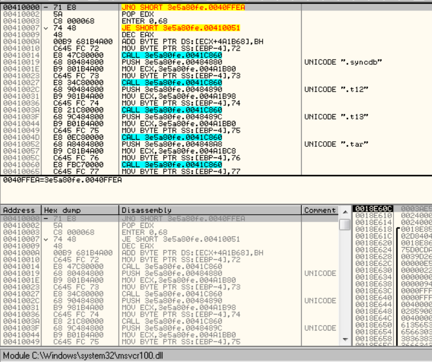
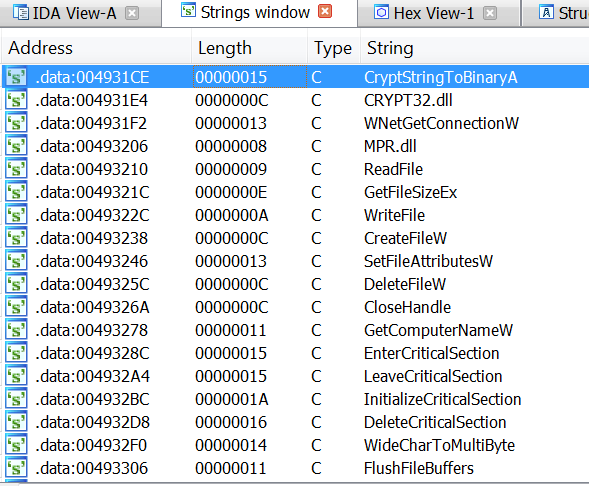
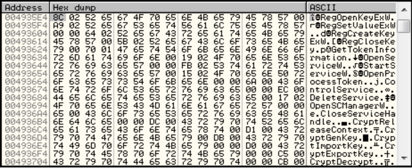
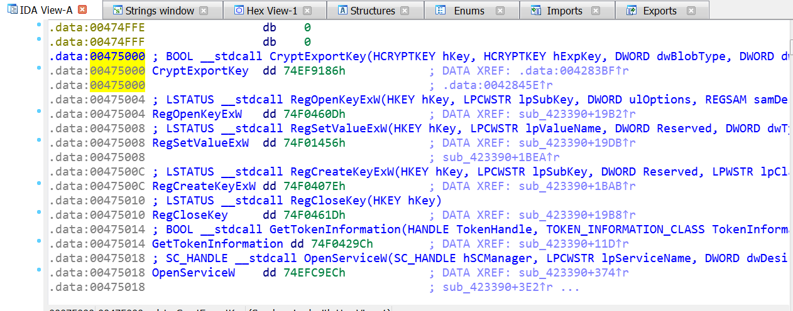

# [For beginners] Using IDAPython to fix Coronalock (BigLock) IAT references in IDA

# Table of contents

1. [Introduction](#introduction)
2. [Tools](#tools)
2. [Unpacking the sample](#unpackingthesample)
4. [The IAT loader](#iatloader)
5. [Fixing the IAT](#fixingiat)
6. [Conclusion](#conclusion)

# Introduction <a name="introduction"></a>

Malware analysts know very well that malware authors use everything in their power to make the analysis of a sample as difficult as possible. They mutate the code, use anti-debugging and anti-virtual machines techniques, use code splicing, *IAT* ([Import Address Table](https://docs.microsoft.com/en-us/windows/win32/debug/pe-format#import-address-table)) redirection, etc; sometimes is easy to get rid of a given ``protection`` mechanism and sometimes is not, it depends on many factors such as analyst's skills, tools available, if the protection mechanism is publicly known, etc. This time, I want to show you a common technique used by [ransomware](https://en.wikipedia.org/wiki/Ransomware#:~:text=Ransomware%20is%20a%20type%20of,unless%20a%20ransom%20is%20paid.&text=Starting%20from%20around%202012%20the,first%20six%20months%20of%202018.). In fact, I have come across this technique several times from different ransomware families that I have analyzed lately.

It's very common to see ransomware samples packed with customs or public packers and implementing a runtime [IAT loader](http://sandsprite.com/CodeStuff/Understanding_imports.html). Basically, the samples start with a very tiny *IAT* (some times not even that) and then, during its execution, start to build a much bigger *IAT* with all the functions needed to work properly. This makes the static analysis of the sample a little bit harder because the *IAT* is, sometimes, placed outside the *PE* image. Some other times, they just use direct calls/jumps to *API* functions making the *PE* dump to contain bad references.

[Biglock](https://id-ransomware.blogspot.com/2020/05/biglock-ransomware.html) a.k.a *Coronalock* is not an exception, [the sample I've analyzed](https://www.virustotal.com/gui/file/e2c2a80cb4ecc511f30d72b3487cb9023b40a25f6bbe07a92f47230fb76544f4/detection) has two layers and the last one includes a runtime *IAT* loader.

# Tools <a name="tools"></a>

- Windows 7 x64
- [OllyDbg](http://www.ollydbg.de/) + [Ollydump](http://www.openrce.org/downloads/details/108/OllyDump)
- [IDA](https://www.hex-rays.com/products/ida/support/download_freeware/) + IDAPython

# Unpacking the sample <a name="unpackingthesample"></a>

The unpacking process is really simple. The first time I unpacked the sample, I ended up removing two layers from the original sample. Unfortunately, I didn't write the necessary steps I followed. However, when trying to replicate the work for this tutorial, I found an easier approach that allows to directly jump to the second layer at once without the need of removing any extra layer first.

The sample calls several times to [VirtualAlloc](https://docs.microsoft.com/en-us/windows/win32/api/memoryapi/nf-memoryapi-virtualalloc) in order to create a few memory regions and place there some encrypted code, decrypt it and then overwrites the image its executing by previously doing a call to [VirtualProtect](https://docs.microsoft.com/en-us/windows/win32/api/memoryapi/nf-memoryapi-virtualprotect). So, the simple way to unpack it is to place a breakpoint there and trace until the point the code jumps to the *OEP* (Original Entry Point).

To make the story short, you'll see that the third time it stops, you'll land in a place like this:



If you trace the code a little bit you'll see that the only thing it does is to get a pointer to each of the [PE](https://en.wikipedia.org/wiki/Portable_Executable) sections and call *VirtualProtect* to restore the original protections that were modified in order to overwrite the original code, no mysterious here.

After that, it does a final call to *VirtualProtect* to mark the *PE* header as ``PAGE_EXECUTE_READWRITE`` and finally jumps to the *OEP*:



If you look at the string xrefs at this point, you'll see that strings were decrypted:


The following is a picture of the original ones:



The only thing you have to do at this point is to use *Ollydump*, or the dumper of your choice, to dump the memory to a file.

# The IAT loader <a name="iatloader"></a>

If you didn't close *Ollydbg* when you had the sample stopped at the *OEP*, you'll note that there's an *IAT*:


However, this *IAT* is the old one. For some reason, *Ollydbg* didn't refresh it, is still getting the old data from the *PE* header. If you load the dumped file into *Ollydbg* and check the ``.import`` section, you'll see nothing in it's new *IAT* created by *Ollydump* during the dumping process:




This is because, the decrypted code corrupted the ``.import`` section on the original file before reaching the *OEP*. In the following picture, you can see that the *IAT* data was replaced by code:




If you look at the same section in the original file, you'll see the right *IAT*:


It's clear that the ransomware stopped at the *OEP* will need an new *IAT* in order to be able to call functions from the Windows *API*. This is achieved by building a new *IAT* at runtime.

If you look at the string xrefs in *IDA*, you can see that there are a lot of *API* names there, some of them are from the *Microsoft CryptoAPI*, which is very common too see in ransomware:



These strings are not directly referenced in the code, so pressing ``x`` over it is not going to work. However, by examining the code a little bit it can be seen that there are some constructions like this one:

```
.data:004283B3                 push    eax
.data:004283B4                 push    0
.data:004283B6                 push    0
.data:004283B8                 push    8
.data:004283BA                 push    0
.data:004283BC                 push    dword ptr [ebx+14h]
.data:004283BF                 call    dword_475000 --> direct call
```

The call to ``dword_475000`` is going here:

```
.data:00475000 dword_475000    dd 74EF9186h            ; DATA XREF: .data:004283BF↑r
.data:00475000                                         ; .data:0042845E↑r
.data:00475004 dword_475004    dd 74F0460Dh            ; DATA XREF: sub_423390+19B2↑r
.data:00475008 dword_475008    dd 74F01456h            ; DATA XREF: sub_423390+19DB↑r
.data:00475008                                         ; sub_423390+1BEA↑r
.data:0047500C dword_47500C    dd 74F0407Eh            ; DATA XREF: sub_423390+1BAB↑r
.data:00475010 dword_475010    dd 74F0461Dh            ; DATA XREF: sub_423390+19B8↑r
.data:00475014 dword_475014    dd 74F0429Ch            ; DATA XREF: sub_423390+11D↑r
.data:00475018 dword_475018    dd 74EFC9ECh            ; DATA XREF: sub_423390+374↑r
.data:00475018                                         ; sub_423390+3E2↑r ...
.data:0047501C dword_47501C    dd 74EF7914h            ; DATA XREF: sub_423390+1AD5↑r
.data:00475020 dword_475020    dd 74EFDEEEh            ; DATA XREF: sub_429400+1A↑r
.data:00475024 dword_475024    dd 74EFDED6h            ; DATA XREF: sub_429400+36↑r
.data:00475028 dword_475028    dd 74EFDF06h            ; DATA XREF: sub_4293E0+C↑r
.data:0047502C dword_47502C    dd 74EFDF1Eh            ; DATA XREF: sub_429460+25↑r
.data:0047502C                                         ; sub_429460+4D↑r
.data:00475030 dword_475030    dd 74EFC4BAh            ; DATA XREF: sub_428320+C↑r
.data:00475034                 db 0B4h ; ´
.data:00475035                 db 0DEh ; Þ
.data:00475036                 db 0EFh ; ï
.data:00475037                 db  74h ; t
.data:00475038 dword_475038    dd 74F17733h            ; DATA XREF: sub_4285D0+42↑r
.data:00475038                                         ; sub_4285D0+78↑r
.data:0047503C dword_47503C    dd 74F33284h            ; DATA XREF: .data:004286CD↑r
.data:00475040 dword_475040    dd 74F014FAh            ; DATA XREF: sub_41DDB0+113↑r
```

This table is the *IAT* that was dynamically built by the ransomware before reaching the *OEP* but was dumped ``as is`` by *Ollydump*. You can check this by looking at it in *Ollydbg*:


However, *Ollydbg* is not able to find references to this addresses, mostly because they are called in a direct way. 

If you are curious about where the *IAT* is built, you just need to put a ``HW`` (hardware) breakpoint [1] ``on-write`` (``DWORD``) at the beginning of the table (``dword_475000``) and trace from there. If you do it, you'll see that the breakpoint hits several times before reaching this point:


You can see the following line:

```
004BE371    8907            MOV DWORD PTR DS:[EDI],EAX
```

In which the value from ``EAX`` (the address of the [CryptExportKey](https://docs.microsoft.com/en-us/windows/win32/api/wincrypt/nf-wincrypt-cryptexportkey) function) was moved to the address pointed by ``EDI`` (``00475000``).

The information to build the *IAT* (function names) is placed in the ``.data`` section and is retrieved by the following code:

```
004BE2E2    03DA            ADD EBX,EDX ; get offset in the .data section where function string is
004BE2E4    43              INC EBX
004BE2E5    43              INC EBX
004BE2E6    53              PUSH EBX ; push the name of the function
004BE2E7    81E3 FFFFFF7F   AND EBX,7FFFFFFF
004BE2ED    53              PUSH EBX ; push the name of the function
004BE2EE    FFB5 B5050000   PUSH DWORD PTR SS:[EBP+5B5] ; push module handle
004BE2F4    FF95 B10F0000   CALL DWORD PTR SS:[EBP+FB1]                          ; call GetProcAddress
```

Here's the picture of the ``.data`` section with all the function names:



# Fixing the IAT <a name="fixingiat"></a>

The right way to do the work, let's say a "conservative" way, if you wish, is to find where the new *IAT* is built and take notes of the ``start address`` and ``size`` in order to feed an *IAT* re-builder tool such us ImportREC in order to build the new *IAT* in a new section **BEFORE** dumping the process. But let's suppose that we missed that part, what can we do at this point?. Another solution is to use the information we have in *Ollydbg* to feed an *IDAPython* script in order to rename the addresses we have in *IDA* and make the static analysis in *IDA* a little bit easier. So, I basically wrote the following script in order to fix that:

```python
import idautils
import idc

from struct import unpack

api_list = ["CryptExportKey", "RegOpenKeyExW", "RegSetValueExW", "RegCreateKeyExW", "RegCloseKey", "GetTokenInformation", "OpenServiceW", "StartServiceW", "CryptCreateHash", "CryptHashData", "CryptDestroyHash", "CryptGetHashParam", "CryptDestroyKey", "CryptAcquireContextW", "CryptEncrypt", "CryptDecrypt", "GetUserNameW", "CryptImportKey", "CryptGenKey", "CryptReleaseContext", "CloseServiceHandle", "OpenSCManagerW", "DeleteService", "ControlService", "OpenProcessToken", "CryptStringToBinaryA", "IcmpSendEcho", "IcmpSendEcho2", "IcmpParseReplies", "GetAdaptersInfo", "IcmpCreateFile", "IcmpCloseHandle", "SetEvent", "WaitForSingleObjectEx", "GetLogicalDrives", "FindFirstFileW", "FindNextFileW", "WaitForMultipleObjects", "GetQueuedCompletionStatus", "JUNK_ENTRY", "ResumeThread", "PostQueuedCompletionStatus", "GetExitCodeThread", "TerminateThread", "CreateThread", "ExitProcess", "CreateIoCompletionPort", "HeapCreate", "RtlFreeHeap", "HeapLock", "RtlAllocateHeap", "HeapDestroy", "CreateEventW", "RtlSizeHeap", "RtlGetLastWin32Error", "CreateProcessW", "WaitForSingleObject", "GetCurrentProcess", "lstrcpyW", "Process32FirstW", "lstrcatW", "Process32NextW", "CreateToolhelp32Snapshot", "OpenProcess", "TerminateProcess", "GetShortPathNameW", "GetEnvironmentVariableW", "OpenMutexW", "CreateMutexW", "GetModuleFileNameW", "FlushFileBuffers", "WideCharToMultiByte", "RtlDeleteCriticalSection", "InitializeCriticalSection", "RtlLeaveCriticalSection", "RtlEnterCriticalSection", "GetComputerNameW", "CloseHandle", "DeleteFileW", "SetFileAttributesW", "GetProcessHeap", "SetEnvironmentVariableW", "FreeEnvironmentStringsW", "GetEnvironmentStringsW", "GetCommandLineW", "GetCommandLineA", "GetOEMCP", "GetACP", "IsValidCodePage", "FindFirstFileExW", "VirtualQuery", "RtlReAllocateHeap", "GetTimeZoneInformation", "ReadConsoleW", "SetStdHandle", "EnumSystemLocalesW", "GetUserDefaultLCID", "IsValidLocale", "GetTimeFormatW", "CreateFileW", "WriteFile", "GetFileSizeEx", "ReadFile", "WriteConsoleW", "SetEndOfFile", "HeapUnlock", "GetDateFormatW", "GetFullPathNameW", "RtlSetLastWin32Error", "InitializeCriticalSectionAndSpinCount", "SwitchToThread", "TlsAlloc", "TlsGetValue", "TlsSetValue", "TlsFree", "GetSystemTimeAsFileTime", "GetModuleHandleW", "GetProcAddress", "RtlEncodePointer", "RtlDecodePointer", "MultiByteToWideChar", "GetStringTypeW", "CompareStringW", "LCMapStringW", "GetLocaleInfoW", "GetCPInfo", "IsProcessorFeaturePresent", "IsDebuggerPresent", "UnhandledExceptionFilter", "SetUnhandledExceptionFilter", "GetStartupInfoW", "QueryPerformanceCounter", "GetCurrentProcessId", "GetCurrentThreadId", "RtlInitializeSListHead", "LocalFree", "RtlUnwind", "RaiseException", "FreeLibrary", "LoadLibraryExW", "GetDriveTypeW", "GetFileInformationByHandle", "GetFileType", "PeekNamedPipe", "SystemTimeToTzSpecificLocalTime", "FileTimeToSystemTime", "GetModuleHandleExW", "GetStdHandle", "SetFilePointerEx", "GetConsoleCP", "GetConsoleMode", "GetCurrentDirectoryW", "WNetGetConnectionW", "NetShareEnum", "NetApiBufferFree", "VariantClear", "SHGetFolderPathW", "ShellExecuteExW", "SHEmptyRecycleBinW", "ShellExecuteW", "inet_addr"]

start = idc.read_selection_start()
end = idc.read_selection_end()

index = 0

if start != BADADDR:
	print "[+] Fixing IAT. Start: %x - End: %x - Size: %x" % (start, end, end - start)
	print "--------------------------"
	while start < end:
		bytes = get_bytes(start, 4)
		if unpack("<L", bytes)[0] != 0:
			idc.set_name(start, api_list[index])
			print "--> Name: %s set at: %x" % (api_list[index], start)
			index +=1
		else:
			print "[!] Bytes are zero at: %x" % start
		start += 4
		
```

In order to make the script work, we need to select from the start of the table to the end of it and then run the script with ``ALT+F7``. In this case, the start of the table is ``00475000`` and the end is ``004752A0``.

After the script ran, this is the result:



Now it's a little bit easier to analyze the code ;P

# Conclusion <a name="conclusion"></a>

In this small post, I showed you the right and wrong way to do the things :P Sometimes you don't have the time to perform an exhaustive analysis of a sample and you use a shortcut in order to achieve your goal, that's precisely what I did here. 

I showed you an unorthodox way of fixing an *IAT* (maybe "fixing" is too much, let's say .. mmm .. decorate) in *Coronalock* in order to have all the function references with names to make the analysis easier.

I hope you enjoyed the reading and see you next time!. 

# References

[1] https://processors.wiki.ti.com/index.php/How_Do_Breakpoints_Work